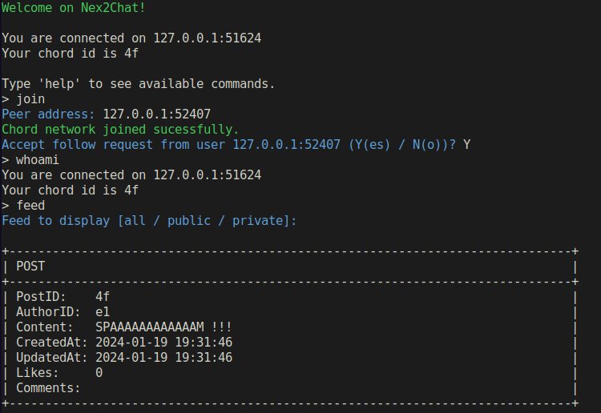
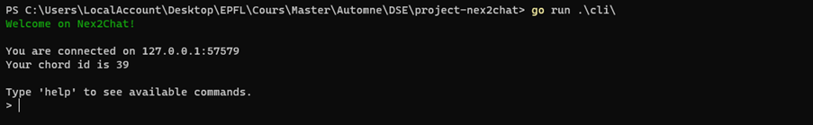
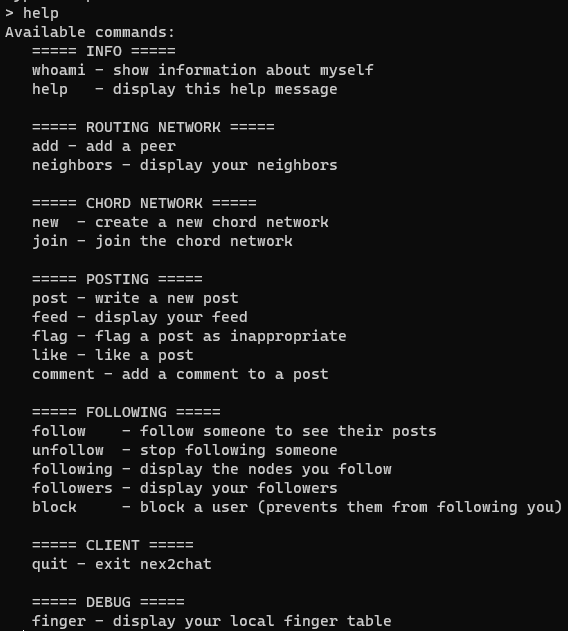
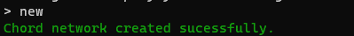
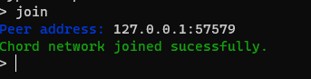
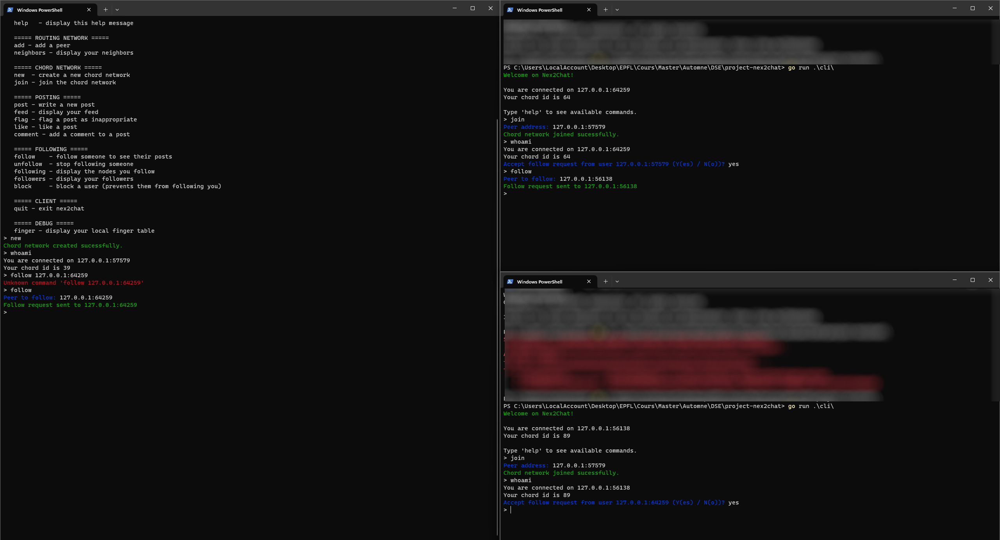

# Nex2Chat



## Dependencies

This project requires go >= 1.21

## Running a node

We provide a command-line application to run a node:

We recommand to set the following environment variable:
```sh
GLOG=no
```

Then to run the code, simply execute the following

```sh
go run ./cli
```

This will start a REPL which allows you to send commands to the node.
For a list of all available commands, use `help`.
The commands do not take arguments on the same line. Rather, they will prompt for additional informations one by one when needed.

## How to use the app ?

### :information_source: !!DISCLAIMER!! :information_source:
```MARKDOWN
###################################
# WHAT OUR APP DOES NOT SUPPPORT! #
###################################
As this is an academic project, we set a scope to our app and therefore it does not support everything as it would happen in real life. Currently the app cannot do the following 
- Accept new node once some message have been sent (Indeed changing the chord network once it has been built is possible but the transmission of the message when updating it and updating the catalog is not implemented. Therefore some message might not be found anymore. Try at your own risk!!!)
- Currently the transmission of the Public Post catalog exists, but is not immediate and imply the user to follow someone. Indeed they are two way for a node to learn the existance of a public post: 1) following someone that has already learnt about it. 2) being assigned by chord to store the message. Therefore it might be difficult to predict if a node has or not the message because it depends of the chord configuration. BUT: if you follow someone that has already aquired the public post in its catalog, then you will for sure retrieve it.
```

Once you start the app, you will be greated with the following message:

<p align="center"></p>

To Display the available command, use the `help` command

<p align="center"></p>

Then you have two options, either creating a new network or joining an existing one.

### Create a new network
To Create a new network, just type in the CLI the command: `new`
<p align="center"></p>
Once the network is created, you will be automatically added to it.

### Joining an existing network

To join an existing network, simply type the command: `join`. Then you will be asked to type the IP address of an existing node of this network as the following screenshot is showing.

<p align="center"></p>

### Let's run a simulation

Let 3 nodes exists: n1, n2, n3.
n1 is following n2
n2 is following n3

<p align="center"></p>

## Running the tests

You can run the test suite using the Makefile (e.g. `make test_n2c`).

